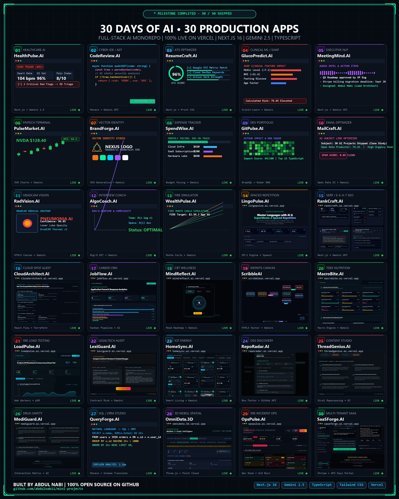

# 🚀 30 AI Projects in 30 Days — Monorepo

[](https://github.com/abdulnabii/mini-projects)
[](https://nextjs.org)
[](https://ai.google.dev)
[](https://www.typescriptlang.org)
[](https://vercel.com)

Welcome to the **30 AI Projects in 30 Days** repository by **Abdul Nabi**. This monorepo documents 30 full-stack AI web applications built sequentially from scratch, each featuring a bespoke design system, production architecture, and verified deployment on Vercel.

---

## 🖼️ Master 30-Day Project Showcase



> *High-Resolution 2400 × 3000 Showcase Poster displaying all 30 project names, categories, and live dashboard interfaces.*

---

## 📌 Complete 30-Day Project Directory

| Day | Project Name | Category | Production Deployment | Status |
|:---:|:---|:---|:---|:---:|
| **01** | 🩺 [HealthPulse.AI](./day-01-ai-symptom-checker) | `Healthcare / Medical AI` | 🌐 [ai-symptom-checker.vercel.app](https://ai-symptom-checker.vercel.app) | ✅ Live |
| **02** | 💻 [CodeReview.AI](./day-02-code-review-bot) | `Developer Tools / Code Security` | 🌐 [code-review-bot.vercel.app](https://code-review-bot.vercel.app) | ✅ Live |
| **03** | 📄 [ResumeCraft.AI](./day-03-smart-resume-builder) | `HR Tech / Career Productivity` | 🌐 [smart-resume-builder.vercel.app](https://smart-resume-builder.vercel.app) | ✅ Live |
| **04** | 🩸 [GlucoPredict.AI](./day-04-diabetes-risk-predictor) | `Healthcare ML / Predictive Analytics` | 🌐 [diabetes-risk-predictor.vercel.app](https://diabetes-risk-predictor.vercel.app) | ✅ Live |
| **05** | 🎙️ [MeetingMind.AI](./day-05-ai-meeting-summarizer) | `Productivity / NLP` | 🌐 [day-05-ai-meeting-summarizer.vercel.app](https://day-05-ai-meeting-summarizer.vercel.app) | ✅ Live |
| **06** | 📈 [PulseMarket.AI](./day-06-stock-dashboard) | `FinTech / Market Intelligence` | 🌐 [day-06-stock-dashboard.vercel.app](https://day-06-stock-dashboard.vercel.app) | ✅ Live |
| **07** | 🎨 [BrandForge.AI](./day-07-ai-logo-generator) | `Creative AI / Design Systems` | 🌐 [day-07-ai-logo-generator.vercel.app](https://day-07-ai-logo-generator.vercel.app) | ✅ Live |
| **08** | 💳 [SpendWise.AI](./day-08-smart-expense-tracker) | `Personal Finance / FinTech` | 🌐 [day-08-smart-expense-tracker.vercel.app](https://day-08-smart-expense-tracker.vercel.app) | ✅ Live |
| **09** | 🐙 [GitPulse.AI](./day-09-github-profile-analyzer) | `Developer Tools / Data Visualization` | 🌐 [day-09-github-profile-analyzer.vercel.app](https://day-09-github-profile-analyzer.vercel.app) | ✅ Live |
| **10** | ✉️ [MailCraft.AI](./day-10-ai-email-composer) | `Productivity / Copywriting AI` | 🌐 [day-10-ai-email-composer.vercel.app](https://day-10-ai-email-composer.vercel.app) | ✅ Live |
| **11** | 🩻 [RadVision.AI](./day-11-medical-image-classifier) | `Healthcare AI / Computer Vision` | 🌐 [day-11-medical-image-classifier.vercel.app](https://day-11-medical-image-classifier.vercel.app) | ✅ Live |
| **12** | 🧑‍💻 [AlgoCoach.AI](./day-12-coding-interview-coach) | `Developer Tools / EdTech` | 🌐 [day-12-coding-interview-coach.vercel.app](https://day-12-coding-interview-coach.vercel.app) | ✅ Live |
| **13** | 🔥 [WealthPulse.AI](./day-13-personal-finance-ai) | `FinTech / Wealth Intelligence` | 🌐 [day-13-personal-finance-ai.vercel.app](https://day-13-personal-finance-ai.vercel.app) | ✅ Live |
| **14** | 🌍 [LingoPulse.AI](./day-14-language-flashcard-ai) | `EdTech / Language Acquisition` | 🌐 [day-14-language-flashcard-ai.vercel.app](https://day-14-language-flashcard-ai.vercel.app) | ✅ Live |
| **15** | 🎯 [RankCraft.AI](./day-15-ai-blog-seo-optimizer) | `Developer Tools / SEO & AEO` | 🌐 [day-15-ai-blog-seo-optimizer.vercel.app](https://day-15-ai-blog-seo-optimizer.vercel.app) | ✅ Live |
| **16** | ☁️ [CloudArchitect.AI](./day-16-cloud-architecture-ai) | `Cloud / DevOps Architecture` | 🌐 [day-16-cloud-architecture-ai.vercel.app](https://day-16-cloud-architecture-ai.vercel.app) | ✅ Live |
| **17** | 💼 [JobFlow.AI](./day-17-job-application-tracker) | `Productivity / Career CRM` | 🌐 [day-17-job-application-tracker.vercel.app](https://day-17-job-application-tracker.vercel.app) | ✅ Live |
| **18** | 🧘 [MindReflect.AI](./day-18-mental-health-journal) | `Wellness / Mental Health AI` | 🌐 [day-18-mental-health-journal.vercel.app](https://day-18-mental-health-journal.vercel.app) | ✅ Live |
| **19** | 🎨 [ScribbleAI](./day-19-collaborative-whiteboard) | `Creative / Visual Workspace` | 🌐 [day-19-collaborative-whiteboard.vercel.app](https://day-19-collaborative-whiteboard.vercel.app) | ✅ Live |
| **20** | 🥗 [MacroBite.AI](./day-20-ai-nutrition-planner) | `Health / Nutrition AI` | 🌐 [day-20-ai-nutrition-planner.vercel.app](https://day-20-ai-nutrition-planner.vercel.app) | ✅ Live |
| **21** | ⚡ [LoadPulse.AI](./day-21-api-load-testing-dashboard) | `DevOps / SRE Infrastructure` | 🌐 [day-21-api-load-testing-dashboard.vercel.app](https://day-21-api-load-testing-dashboard.vercel.app) | ✅ Live |
| **22** | ⚖️ [LexiGuard.AI](./day-22-legal-document-analyzer) | `LegalTech / AI Compliance` | 🌐 [day-22-legal-document-analyzer.vercel.app](https://day-22-legal-document-analyzer.vercel.app) | ✅ Live |
| **23** | 🏠 [HomeSync.AI](./day-23-smart-home-dashboard) | `IoT / Smart Home AI` | 🌐 [day-23-smart-home-dashboard.vercel.app](https://day-23-smart-home-dashboard.vercel.app) | ✅ Live |
| **24** | 📡 [RepoRadar.AI](./day-24-opensource-discovery-engine) | `Developer Tools / Open Source` | 🌐 [day-24-opensource-discovery-engine.vercel.app](https://day-24-opensource-discovery-engine.vercel.app) | ✅ Live |
| **25** | 🚀 [ThreadGenius.AI](./day-25-ai-content-studio) | `Content Marketing / Social AI` | 🌐 [day-25-ai-content-studio.vercel.app](https://day-25-ai-content-studio.vercel.app) | ✅ Live |
| **26** | 💊 [MediGuard.AI](./day-26-medication-reminder-system) | `Healthcare AI / Patient Safety` | 🌐 [day-26-medication-reminder-system.vercel.app](https://day-26-medication-reminder-system.vercel.app) | ✅ Live |
| **27** | 🗄️ [QueryForge.AI](./day-27-ai-database-query-builder) | `Database / Developer Tools` | 🌐 [day-27-ai-database-query-builder.vercel.app](https://day-27-ai-database-query-builder.vercel.app) | ✅ Live |
| **28** | 🌐 [OmniData.3D](./day-28-3d-data-visualization) | `Data Visualization / WebGL & Spatial` | 🌐 [day-28-3d-data-visualization.vercel.app](https://day-28-3d-data-visualization.vercel.app) | ✅ Live |
| **29** | 🚨 [OpsPulse.AI](./day-29-devops-incident-assistant) | `DevOps / SRE Incident Management` | 🌐 [day-29-devops-incident-assistant.vercel.app](https://day-29-devops-incident-assistant.vercel.app) | ✅ Live |
| **30** | 🏆 [SaaSForge.AI](./day-30-ai-saas-boilerplate) | `SaaS Architecture / Full-Stack` | 🌐 [day-30-ai-saas-boilerplate.vercel.app](https://day-30-ai-saas-boilerplate.vercel.app) | ✅ Live |

---

## 🛠️ Monorepo Architecture & Standards

Every project in this repository follows strict modern production guidelines:
- **Framework**: Next.js 14 / 16 (App Router + Turbopack) & React 18 / 19
- **Type Safety**: 100% Strict TypeScript
- **AI Integration**: Google Gemini 2.5 & 1.5 Flash APIs (`@google/generative-ai`)
- **Styling**: Tailwind CSS with tailored project design themes (Dark Obsidian, Glassmorphism, Cyber-Terminals)
- **Advanced Tech**: Three.js WebGL (Day 28), Monaco Code Editor (Days 02, 12, 27), React Flow (Day 16), Web Workers Multi-Threading (Day 21), Stripe & Upstash Redis (Day 30)
- **Deployments**: Continuous Deployment via Vercel Edge

---

## 💻 Local Quickstart

To run any of the 30 applications locally:

```bash
# 1. Clone the complete monorepo
git clone https://github.com/abdulnabii/mini-projects.git
cd mini-projects

# 2. Navigate to your desired project (example: Day 30 SaaS Boilerplate)
cd day-30-ai-saas-boilerplate

# 3. Install dependencies
npm install

# 4. Set up your Gemini API Key
echo "GEMINI_API_KEY=your_api_key_here" > .env.local

# 5. Start the development server
npm run dev
```

Open [http://localhost:3000](http://localhost:3000) in your browser.

---

## 📢 Grand Finale LinkedIn Announcement

The complete 30-day milestone announcement post, summary statistics, and viral copy are available in:  
📄 **[`LINKEDIN_30_DAYS_COMPLETION_POST.md`](./LINKEDIN_30_DAYS_COMPLETION_POST.md)**

---

## 👤 Author & Connect

- **Author**: Abdul Nabi
- **GitHub**: [@abdulnabii](https://github.com/abdulnabii)
- **Monorepo**: [github.com/abdulnabii/mini-projects](https://github.com/abdulnabii/mini-projects)

⭐ **If you find this repository valuable, please consider giving it a star on GitHub!**
