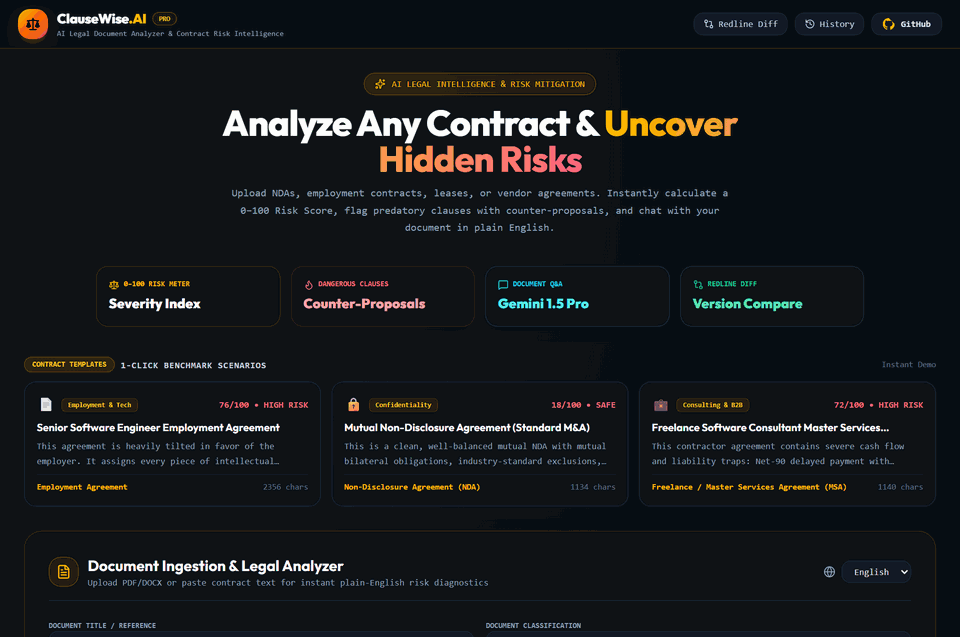

# ⚖️ Day 22 — LexiGuard.AI
> **Legal Document Analyzer & Contract Risk Auditor**

[](https://nextjs.org)
[](https://www.typescriptlang.org)
[](https://ai.google.dev)
[](https://tailwindcss.com)
[](https://day-22-legal-document-analyzer.vercel.app)
[](https://opensource.org/licenses/MIT)

---

## 🌐 Quick Links

- **Live Production URL**: [day-22-legal-document-analyzer.vercel.app](https://day-22-legal-document-analyzer.vercel.app)
- **Monorepo Repository**: [github.com/abdulnabii/mini-projects](https://github.com/abdulnabii/mini-projects)
- **Author**: Abdul Nabi ([@abdulnabii](https://github.com/abdulnabii))
- **Challenge Series**: **Day 22 of 30 Days 30 AI Projects**

---

## 🎥 Live Demo Preview



## 💡 Overview

Contract intelligence tool parsing NDAs, SaaS agreements, and employment contracts to surface high-risk indemnification clauses, non-compete liabilities, and plain-English summaries.

---

## ✨ Key Features

- **Automated Clause Risk Classification**: Flags legal clauses into Low, Medium, and High Risk with clear severity explanations.
- **Red-Flag Liability Detector**: Surfaces uncapped liability, one-sided indemnification, and aggressive non-solicitation language.
- **Plain-English Legal Translator**: Translates dense legal jargon into clear, straightforward executive explanations.
- **Negotiation Counter-Proposal Generator**: Provides alternative clause phrasing that balances legal risk for freelancers and SMBs.
- **Full Document Audit Report**: Downloadable PDF executive summary highlighting all key commitments and expiration dates.

---

## 🛠️ Architecture & Tech Stack

| Component | Technology | Description |
|:---|:---|:---|
| **Framework** | Next.js (App Router + Turbopack) | Modern React Server Components architecture |
| **Language** | TypeScript | Strict type safety and predictable interfaces |
| **AI Intelligence** | Google Gemini API | Natural language understanding, vision analysis & code synthesis |
| **Styling** | Tailwind CSS | High-contrast obsidian dark mode & responsive ergonomics |
| **Deployment** | Vercel | Global edge CDN deployment with automated CI/CD |

**Detailed Stack**: `Next.js 16, TypeScript, Tailwind CSS, Google Gemini API`

---

## 💻 Local Development Setup

Follow these steps to run **LexiGuard.AI** locally:

1. **Clone the repository:**
   ```bash
   git clone https://github.com/abdulnabii/mini-projects.git
   cd mini-projects/day-22-legal-document-analyzer
   ```

2. **Install dependencies:**
   ```bash
   npm install
   ```

3. **Configure environment variables:**
   Create a `.env.local` file in the root of `day-22-legal-document-analyzer`:
   ```env
   GEMINI_API_KEY=your_gemini_api_key_here
   ```
   *(Get your free API key from [Google AI Studio](https://aistudio.google.com/))*

4. **Start the local development server:**
   ```bash
   npm run dev
   ```

5. **Open in browser:**
   Navigate to [http://localhost:3000](http://localhost:3000) to explore the application.

---

## 🚀 Production Deployment on Vercel

This project is pre-configured for instant zero-configuration deployment on **Vercel**:

1. Push your repository to GitHub.
2. Import the project into the [Vercel Dashboard](https://vercel.com).
3. Set the **Root Directory** to `day-22-legal-document-analyzer`.
4. Add the `GEMINI_API_KEY` environment variable in Vercel settings.
5. Click **Deploy**!

---

## 🗺️ 30 Days of AI Navigation

| ⬅️ Previous Project | 🏠 Central Monorepo | ➡️ Next Project |
|:---:|:---:|:---:|
| [⚡ Day 21: LoadPulse.AI](../day-21-api-load-testing-dashboard) | [📂 View All 30 Projects](https://github.com/abdulnabii/mini-projects#readme) | [🏠 Day 23: HomeSync.AI](../day-23-smart-home-dashboard) |

---

## 👤 Author & Acknowledgements

- **Developer**: Abdul Nabi
- **GitHub**: [@abdulnabii](https://github.com/abdulnabii)
- **Monorepo**: [30 Days 30 AI Projects](https://github.com/abdulnabii/mini-projects)

*Built with passion as part of the 30 Days 30 AI Projects challenge.*
