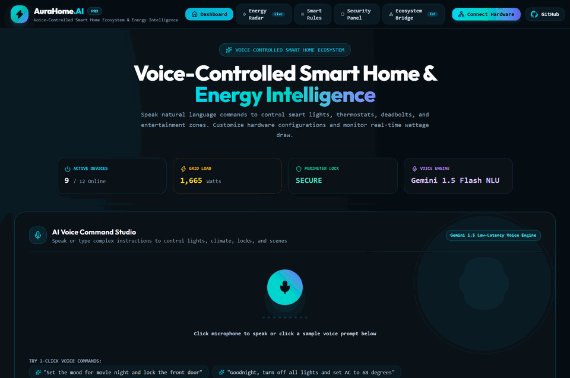

# 🏠 Day 23 — HomeSync.AI
> **Smart Home IoT Ecosystem & Energy Optimization Hub**

[](https://nextjs.org)
[](https://www.typescriptlang.org)
[](https://ai.google.dev)
[](https://tailwindcss.com)
[](https://day-23-smart-home-dashboard.vercel.app)
[](https://opensource.org/licenses/MIT)

---

## 🌐 Quick Links

- **Live Production URL**: [day-23-smart-home-dashboard.vercel.app](https://day-23-smart-home-dashboard.vercel.app)
- **Monorepo Repository**: [github.com/abdulnabii/mini-projects](https://github.com/abdulnabii/mini-projects)
- **Author**: Abdul Nabi ([@abdulnabii](https://github.com/abdulnabii))
- **Challenge Series**: **Day 23 of 30 Days 30 AI Projects**

---

## 🎥 Live Demo Preview



## 💡 Overview

Unified IoT control platform managing smart lighting, climate, security cameras, and automated energy-saving routines with real-time kilowatt telemetry.

---

## ✨ Key Features

- **Room-by-Room IoT Control**: Instant toggling of lights, temperature, and locks across Living Room, Kitchen, Office, and Master Bedroom.
- **Interactive Thermostat Dial**: Circular SVG thermostat controller with Target, Ambient, and Humidity gauges.
- **Real-Time Energy Telemetry**: Live wattage tracking correlating energy consumption against utility peak hours.
- **AI Energy Optimization Routines**: Automated scheduling reducing unnecessary HVAC and standby appliance power drain.
- **Security Surveillance Hub**: Simulated live camera feeds and door access logs with instant alert notifications.

---

## 🛠️ Architecture & Tech Stack

| Component | Technology | Description |
|:---|:---|:---|
| **Framework** | Next.js (App Router + Turbopack) | Modern React Server Components architecture |
| **Language** | TypeScript | Strict type safety and predictable interfaces |
| **AI Intelligence** | Google Gemini API | Natural language understanding, vision analysis & code synthesis |
| **Styling** | Tailwind CSS | High-contrast obsidian dark mode & responsive ergonomics |
| **Deployment** | Vercel | Global edge CDN deployment with automated CI/CD |

**Detailed Stack**: `Next.js 16, SVG Gauges, TypeScript, Tailwind CSS, Google Gemini API`

---

## 💻 Local Development Setup

Follow these steps to run **HomeSync.AI** locally:

1. **Clone the repository:**
   ```bash
   git clone https://github.com/abdulnabii/mini-projects.git
   cd mini-projects/day-23-smart-home-dashboard
   ```

2. **Install dependencies:**
   ```bash
   npm install
   ```

3. **Configure environment variables:**
   Create a `.env.local` file in the root of `day-23-smart-home-dashboard`:
   ```env
   GEMINI_API_KEY=your_gemini_api_key_here
   ```
   *(Get your free API key from [Google AI Studio](https://aistudio.google.com/))*

4. **Start the local development server:**
   ```bash
   npm run dev
   ```

5. **Open in browser:**
   Navigate to [http://localhost:3000](http://localhost:3000) to explore the application.

---

## 🚀 Production Deployment on Vercel

This project is pre-configured for instant zero-configuration deployment on **Vercel**:

1. Push your repository to GitHub.
2. Import the project into the [Vercel Dashboard](https://vercel.com).
3. Set the **Root Directory** to `day-23-smart-home-dashboard`.
4. Add the `GEMINI_API_KEY` environment variable in Vercel settings.
5. Click **Deploy**!

---

## 🗺️ 30 Days of AI Navigation

| ⬅️ Previous Project | 🏠 Central Monorepo | ➡️ Next Project |
|:---:|:---:|:---:|
| [⚖️ Day 22: LexiGuard.AI](../day-22-legal-document-analyzer) | [📂 View All 30 Projects](https://github.com/abdulnabii/mini-projects#readme) | [📡 Day 24: RepoRadar.AI](../day-24-opensource-discovery-engine) |

---

## 👤 Author & Acknowledgements

- **Developer**: Abdul Nabi
- **GitHub**: [@abdulnabii](https://github.com/abdulnabii)
- **Monorepo**: [30 Days 30 AI Projects](https://github.com/abdulnabii/mini-projects)

*Built with passion as part of the 30 Days 30 AI Projects challenge.*
