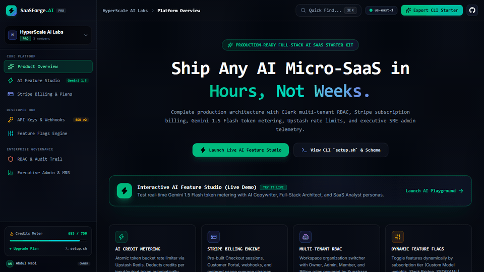

# 🏆 Day 30 — SaaSForge.AI
> **Multi-Tenant AI SaaS Boilerplate & Starter Kit**

[](https://nextjs.org)
[](https://www.typescriptlang.org)
[](https://ai.google.dev)
[](https://tailwindcss.com)
[](https://day-30-ai-saas-boilerplate.vercel.app)
[](https://opensource.org/licenses/MIT)

---

## 🌐 Quick Links

- **Live Production URL**: [day-30-ai-saas-boilerplate.vercel.app](https://day-30-ai-saas-boilerplate.vercel.app)
- **Monorepo Repository**: [github.com/abdulnabii/mini-projects](https://github.com/abdulnabii/mini-projects)
- **Author**: Abdul Nabi ([@abdulnabii](https://github.com/abdulnabii))
- **Challenge Series**: **Day 30 of 30 Days 30 AI Projects**

---

## 🎥 Live Demo Preview



## 💡 Overview

The Grand Finale of the 30 Days 30 AI Projects challenge. An enterprise-grade, multi-tenant AI SaaS starter platform featuring Stripe subscriptions, Clerk auth, workspace quotas, API keys portal, Upstash Redis token bucket rate limiting, and executive admin telemetry.

---

## ✨ Key Features

- **Multi-Tenant Workspaces & RBAC**: Dynamic workspace switcher with Owner, Admin, Member, and Billing Manager permissions.
- **Stripe Subscription Billing & Portal**: Free ($0), Pro ($19/mo), and Enterprise ($99/mo) plans with checkout simulator and receipts.
- **Developer API Keys Portal**: Generate, copy, revoke, and manage secure simulated `sf_live_` API credentials with quota indicators.
- **Token Bucket Credit Metering**: Strict tier-based rate limiting powered by Upstash Redis with real-time token deduction.
- **Executive SRE Telemetry Console**: Live MRR ($14,850), ARR ($178,200), Active Users, Churn Rate (1.8%), and error rate charts.
- **Global ⌘K Command Palette**: Fast keyboard navigation across all modules, billing, API keys, and workspace settings.
- **Automated CI/CD Workflows**: Production-verified GitHub Actions deployment pipelines for zero-downtime Vercel releases.

---

## 🛠️ Architecture & Tech Stack

| Component | Technology | Description |
|:---|:---|:---|
| **Framework** | Next.js (App Router + Turbopack) | Modern React Server Components architecture |
| **Language** | TypeScript | Strict type safety and predictable interfaces |
| **AI Intelligence** | Google Gemini API | Natural language understanding, vision analysis & code synthesis |
| **Styling** | Tailwind CSS | High-contrast obsidian dark mode & responsive ergonomics |
| **Deployment** | Vercel | Global edge CDN deployment with automated CI/CD |

**Detailed Stack**: `Next.js 16 (Turbopack), TypeScript, Stripe, Upstash Redis, Clerk, Tailwind CSS v4, Gemini API`

---

## 💻 Local Development Setup

Follow these steps to run **SaaSForge.AI** locally:

1. **Clone the repository:**
   ```bash
   git clone https://github.com/abdulnabii/mini-projects.git
   cd mini-projects/day-30-ai-saas-boilerplate
   ```

2. **Install dependencies:**
   ```bash
   npm install
   ```

3. **Configure environment variables:**
   Create a `.env.local` file in the root of `day-30-ai-saas-boilerplate`:
   ```env
   GEMINI_API_KEY=your_gemini_api_key_here
   ```
   *(Get your free API key from [Google AI Studio](https://aistudio.google.com/))*

4. **Start the local development server:**
   ```bash
   npm run dev
   ```

5. **Open in browser:**
   Navigate to [http://localhost:3000](http://localhost:3000) to explore the application.

---

## 🚀 Production Deployment on Vercel

This project is pre-configured for instant zero-configuration deployment on **Vercel**:

1. Push your repository to GitHub.
2. Import the project into the [Vercel Dashboard](https://vercel.com).
3. Set the **Root Directory** to `day-30-ai-saas-boilerplate`.
4. Add the `GEMINI_API_KEY` environment variable in Vercel settings.
5. Click **Deploy**!

---

## 🗺️ 30 Days of AI Navigation

| ⬅️ Previous Project | 🏠 Central Monorepo | ➡️ Next Project |
|:---:|:---:|:---:|
| [🚨 Day 29: OpsPulse.AI](../day-29-devops-incident-assistant) | [📂 View All 30 Projects](https://github.com/abdulnabii/mini-projects#readme) | [🎉 Complete Monorepo Root](../../#readme) |

---

## 👤 Author & Acknowledgements

- **Developer**: Abdul Nabi
- **GitHub**: [@abdulnabii](https://github.com/abdulnabii)
- **Monorepo**: [30 Days 30 AI Projects](https://github.com/abdulnabii/mini-projects)

*Built with passion as part of the 30 Days 30 AI Projects challenge.*
